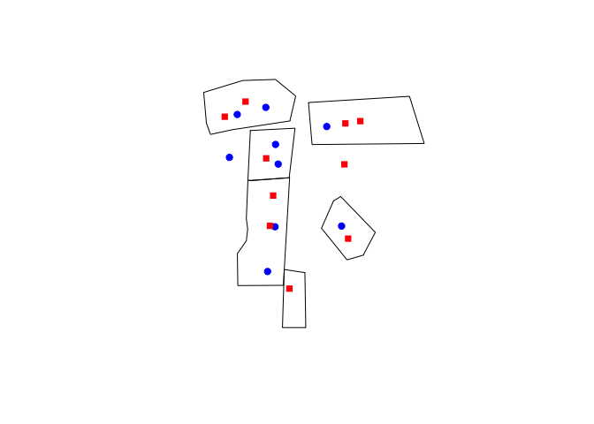

<!-- README.md is generated from README.Rmd. Please edit that file -->

## Overview

sppt is an [R](https://www.r-project.org) package that implements
several Spatial Point Pattern Tests. This package started with Martin
Andresen’s original ‘sppt’ that is published
[here](http://jrc.sagepub.com/content/48/1/58) and elsewhere.

The Spatial Point Pattern Tests in this package measure the degree of
similarity at the local level between two spatial pointpatterns and are
area-based tests.

These tests are not for the purpose of testing point patterns with the
null hypotheses of random, uniform, or clustered distributions, but may
be used to compare a particular point pattern with these distributions.
One advantage is that it can be performed for a number of different area
boundaries using the same original point datasets.

## Version

The most recent version of the package is:

> Steenbeek, W., Vandeviver, C. Andresen, M.A., Malleson, N., Wheeler,
> A. (2018). *sppt: Spatial Point Pattern Test*. R package version
> 0.2.3. URL: <https://github.com/wsteenbeek/sppt>

An archive of older versions of the package can be found here:
<https://github.com/wsteenbeek/sppt-archive>.

## Installation

You can install the package from this [GitHub
repository](https://github.com/wsteenbeek/sppt). You first need to
install the [remotes](https://CRAN.R-project.org/package=remotes)
package.

``` r
install.packages("remotes")
```

Then install sppt using the `install_github` function in the
[remotes](https://CRAN.R-project.org/package=remotes) package.

``` r
remotes::install_github("wsteenbeek/sppt")
```

## Example

Spatial objects areas.sp, points1.sp, and points2.sp, are included in
the package. For example, you can think of these as neighborhoods and
the locations where crimes occur in two different years.

``` r
library(sppt)
plot(areas.sp)
points(points1.sp, col="blue", pch = 19)
points(points2.sp, col="red", pch = 15)
```

<!-- -->

The original function within the sppt package is also called `sppt`:

``` r
set.seed(93255) # set seed for reproducibility
output <- sppt(points1.sp, points2.sp, areas.sp)
```

Two other functions were added in February 2018. `sppt_boot()`:

``` r
set.seed(93255) # set seed for reproducibility
output2 <- sppt_boot(points1.sp, points2.sp, areas.sp)
```

and `sppt_diff()`:

``` r
set.seed(93255) # set seed for reproducibility
output3 <- sppt_diff(points1.sp, points2.sp, areas.sp)
```

You can see the results of the test by inspecting the
SpatialPolygonsDataFrame, for example:

``` r
output@data
#>   ID uoa_id SIndex NumBsePts NumTstPts PctBsePts PctTstPts SumBseTstPts
#> 0  1      1      0         2         2      25.0  22.22222            4
#> 1  4      2      1         2         1      25.0  11.11111            3
#> 2  5      3      0         2         2      25.0  22.22222            4
#> 3  6      4      0         1         2      12.5  22.22222            3
#> 4 11      5      0         0         1       0.0  11.11111            1
#> 5 15      6      0         1         1      12.5  11.11111            2
#>   ConfLowP ConfUppP localS similarity   globalS SIndex.robust localS.robust
#> 0     12.5     25.0      0          1 0.8333333             0             0
#> 1      0.0     12.5     -1          0 0.8333333             1            -1
#> 2     12.5     25.0      0          1 0.8333333             0             0
#> 3     12.5     25.0      0          1 0.8333333             0             0
#> 4      0.0     12.5      0          1 0.8333333             0             0
#> 5      0.0     12.5      0          1 0.8333333             0             0
#>   similarity.robust globalS.robust generalizedS.robust
#> 0                 1      0.8333333           0.8333333
#> 1                 0      0.8333333           0.8333333
#> 2                 1      0.8333333           0.8333333
#> 3                 1      0.8333333           0.8333333
#> 4                 1      0.8333333           0.8333333
#> 5                 1      0.8333333           0.8333333
```

## Vignettes

The package includes vignettes explaining the sppt procedure in more
detail; a worked example of a toy dataset and actual crime data; a
comparison between this R package and an existing Java application that
has been written by [Nick Malleson](http://nickmalleson.co.uk/); and the
new functions `sppt_boot()` and `sppt_diff()`.

By far the easiest way to view the vignettes are these direct links,
courtesy of the [GitHub HTML Preview
service](http://htmlpreview.github.io/):

1.  [Introduction to Spatial Point Pattern
    Test](http://htmlpreview.github.io/?https://github.com/wsteenbeek/sppt/blob/master/doc/sppt_intro.html)

2.  [Comparing R vs
    Java](http://htmlpreview.github.io/?https://github.com/wsteenbeek/sppt/blob/master/doc/sppt_comparison.html)

3.  [Proportion difference
    tests](http://htmlpreview.github.io/?https://github.com/wsteenbeek/sppt/blob/master/doc/sppt_diff.html)

If instead you want to access the vignettes from R itself you need to
take a few additional steps, because `remotes::install_github()` does
not build vignettes by default to save time and because it may require
additional packages.

1.  Install the rmarkdown package with `install.packages("rmarkdown")`

2.  [Install pandoc](http://johnmacfarlane.net/pandoc/installing.html)
    (and afterwards restart your computer)

3.  Then, install the package again but force building of the vignettes
    using `remotes::install_github("wsteenbeek/sppt", build_vignettes =
    TRUE, force = TRUE)`. This will take a few minutes.

Afterwards, you should be able to view which vignettes are available
using:

``` r
browseVignettes("sppt")
```

To directly read the vignettes rather than going through
`browseVignettes("sppt")` you can use:

``` r
vignette("sppt_intro", package = "sppt")
vignette("sppt_comparison", package = "sppt")
vignette("sppt_diff", package = "sppt")
```

## License

This package is free software; you can redistribute it and/or modify it
under the terms of the GNU General Public License, version 3, as
published by the Free Software Foundation.

This program is distributed in the hope that it will be useful, but
without any warranty; without even the implied warranty of
merchantability or fitness for a particular purpose. See the GNU General
Public License for more details.

A copy of the GNU General Public License, version 3, is available at
<https://www.r-project.org/Licenses/GPL-3>
